title: Ruby
author: Daniel Schmidt

%%%%%
%% Add some inline style rules...

%css

@font-face {
  font-family: FontAwesome;
  src: url('FontAwesome.ttf');
}

@font-face {
  font-family: Chunkfive;
  src: url('Chunkfive.otf');
}

body {
  background-color: #9ACD34;
  color: white; 
}

html{
  font-family: Chunkfive, Georgia, Palatino, Times New Roman, serif;
}

#company_logo{
  background: url('images/signet.jpeg') no-repeat;
  width:190px;
  height:122px;
}

h2{
  color: white;
  margin-top:0px;
  padding:20px;
  text-align:left;
  background-color:black;
  font-size:42px;
}

h2 a{
  color:white;
}

.step {
  width: 800px;
  height: 600px;
  font-size: 48px;
  text-align: center;
  color: black;
  opacity: 0.3;
  /*
  border-radius: 10px;
  border: 2px solid blue;
  background-color: #99dd10;*/
}

.step.active {
  opacity: 1;
  /*border: 3px solid red;*/
  background-color: white;
}

code {
  background-color: red;
  font-size: 24px;
  color: white;
  padding: 20px;
}

.smaller_step{
  font-size:42px;
  text-align:left;
}

.very_small_step{
  font-size:20px;
}

ul{
  list-style:none;
}

li{
  text-align:left;
}

#octocat{
  width: 297px;
  float:left;
}

#github_links{
  margin-left: 180px;
  font-size:0.8em;
}

#github_links ul li{
  text-align: left;
}

.gist{
  font-size: 0.6em;
  text-align:left;
}

#priest{
  background: url('images/marry.png');
  width:800px;
  height:600px;
}

#only_priest{
  background: url('images/priest_only.png');
  width:800px;
  height:600px;
}

#sender{
  background: url('images/sender.png');
  width:800px;
  height:600px;
}

#method_call{
  position:absolute;
  top:330px;
  left:50px;
}

.overall_background{
  z-index: -999;
  min-height: 100%;
  min-width: 600px;
  width: 100%;
  height: auto;
  position: fixed;
  top: 0;
  left: 0;
}

#wrapper {
  position: relative;
  width: 800px;
  min-height: 400px;
  margin: 100px auto;
  color: #333;
}

.fixnum_rotated{
  -webkit-transform: rotate(-5deg);
  position:absolute;
  left:400px;
  top:240px;
}

.superclass_rotated{
  -webkit-transform: rotate(5deg);
  position:absolute;
  left:400px;
  top:351px;
}

.nil_rotated{
  -webkit-transform: rotate(-5deg);
  position:absolute;
  left:200px;
  top:440px;
}

#origin{
  font-size:0.3em;
  color: gray;
  position:absolute;
  top: 580px;
  left:500px;
}

.important{
  color:red;
  font-weight:bold;
}

#rob_link{
  position:absolute;
  top:400px;
  left:500px;  
}

#rob_link a{
  color:white;
}

#cls_equality{
  position: absolute;
  top:400px;
  left:30px;
}

#me_container{
  text-align:left;
  margin-left:25px;
}

#me_position{
  text-align:left;
  color:gray;
}

#me_container .twitter{
  font-family: FontAwesome;
  color: #52D5F4;
  font-size: 1.5em;
  position:relative;
  margin-top:10px;
}

#additional_me{
  color:gray;
}

.white_font{
  color:white;
  text-align:left;
  font-size:0.7em;
  margin-left:10px;
  margin-top:-50px;
}

%end

%

%

%%%%%%%%%%%%%%%%%%%
%% Here we go...

!SLIDE slide x=-1000 y=-1500

## Ruby

!SLIDE slide x=-1000 y=-500

!SLIDE slide x=-50 y=-1500 

## Me

 
  Softwareentwickler@datenspiel
  p @dsci_
  
  <ul>
    <li>Ruby</li>
    <li>Rails</li>
    <li>Node.js</li>
    <li>CoffeeScript</li>
  </ul>

!SLIDE slide x=1000 y=-1500

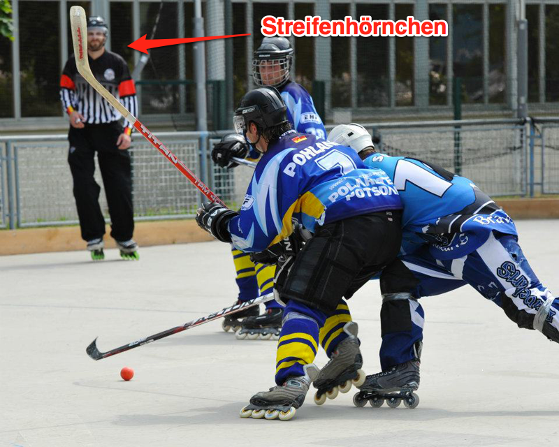

!SLIDE rotate=180 x=1950 y=-1500

## Github

  

    <ul>
      <li>http://github.com/dsci</li>
      <li>&nbsp;</li>
      <li>http://github.com/datenspiel</li>
    </ul>
  

!SLIDE rotate=180 x=900 y=-13600

## Ruby is lovely

<i>Mitte der neunziger Jahre von dem Japaner Yukihiro Matsumoto entworfen.</i>

!SLIDE x=1800 y=-13600 rotate=180

## Ruby only supports instance methods!

!SLIDE x=2700 y=-13600 slide

## Konventionen! 

**Variablen**

<code class="abc">first_step_to_go</code>

Klein geschrieben mit Unterstrich.

!SLIDE slide x=3850 y=-13600

## Konventionen!

**Konstanten**: 

<ul>
<li><code>Dance</code></li>
<li>&nbsp;</li>
<li><code>StepDance</code></li>
<li>&nbsp;</li>
<li><code>LineDance</code></li>
</ul>

Zusammen & groß geschrieben.

!SLIDE slide x=5000 y=-12700

## Konventionen!
**Dateinamen**

* <code>first_step_to_go.rb</code>

Klein geschrieben mit Unterstrich.

!SLIDE slide x=5000 y=-12000

## Konventionen!
**Konstanten**

analog Klassennamen

!SLIDE rotate=20 scale=4 x=5000 y=-8000

## Datentypen, Grundlagen

**Alles ist ein Objekt**

* nil
* Class
* Fixnum
* true
* false

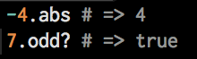
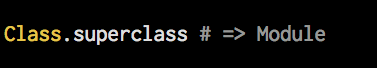
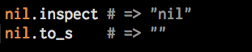

!SLIDE x=9000 y=-8000 slide

## Datentypen - Strings

* single quoted strings
* &nbsp;
* double quoted strings
  * 'escapen' von Sequencen (\t,\n...)

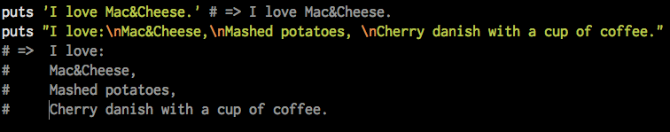

!SLIDE x=10000 y=-8000 slide

## Datentypen - Numbers

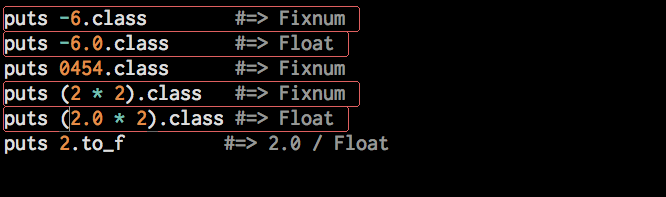

!SLIDE x=11000 y=-8000 slide

## Datentypen - Collections (Array)

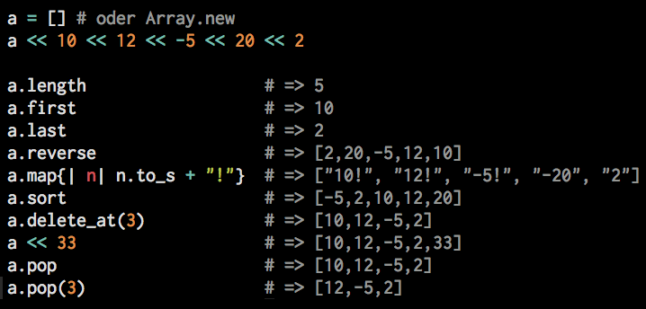

!SLIDE x=12000 y=-8000 slide

## Datentypen - Collections (Hash)

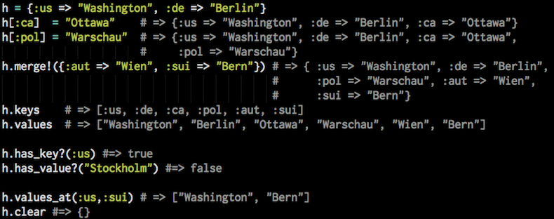

!SLIDE x=13000 y=-8000 slide

## Operatoren

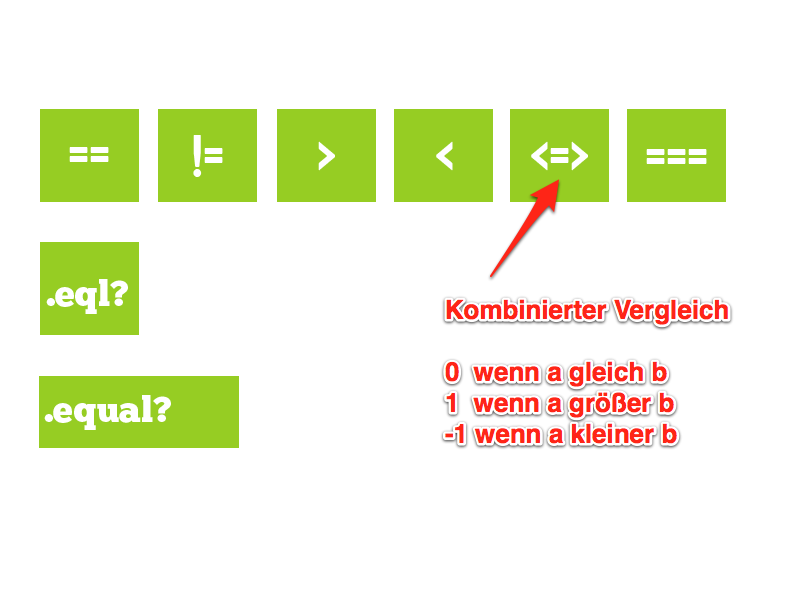

!SLIDE x=14000 y=-8000 slide

## Operatoren

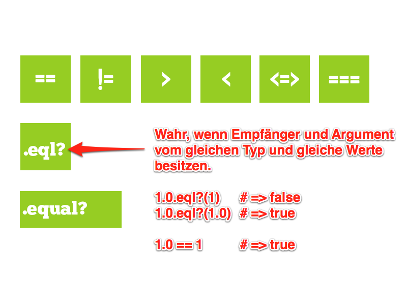

!SLIDE x=15000 y=-8000 slide

## Operatoren

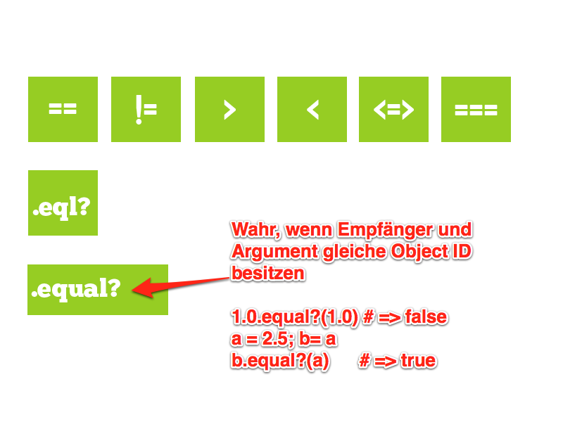

!SLIDE x=16000 y=-8000 slide

## Anweisungen, Iteratoren und Loops

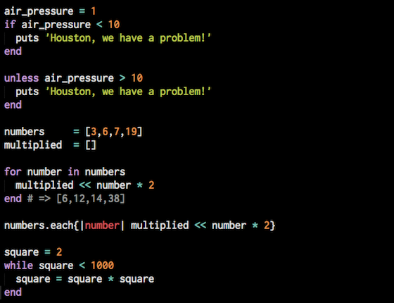

!SLIDE x=17000 y=-8000 slide

## 'Post conditions'

* Sehr sprachnah. 
* Bei einfachen Anweisungen nutzen! 

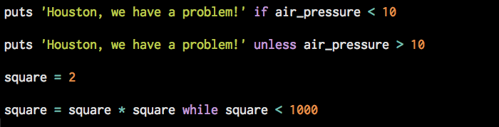 

!SLIDE x=200 y=-2400 slid200

## receiver and sender

Methodenaufrufe sind Anfragen an einen Empfänger. 

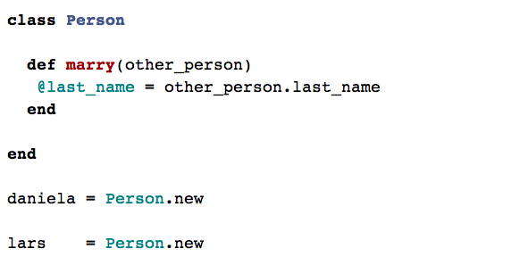

!SLIDE x=1100 y=-2400 slide

!SLIDE x=2000 y=-2400 slide

  

    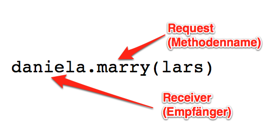
  

!SLIDE x=2900 y=-2400 slide

!SLIDE x=3900 y=-2400 slide

## Ducktyping

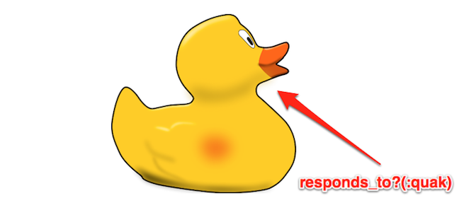

> "It walks like a duck, it sounds like a duck - it must be a duck!"

  <i>frei nach James Whitcomb Riley</i>

!SLIDE slide x=4800 y=-2400

## Ducktyping <a href="https://gist.github.com/5d1c654d761a437733c3">(Beispiel)</a>

Typ eines Objekts wird danach definiert, was ein Objekt kann.

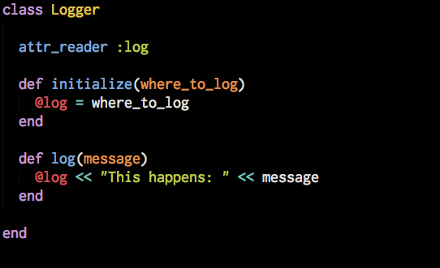

!SLIDE slide x=5700 y=-2400

## self

* expliziter Methodenempfänger
* self ändert seinen Kontext
* wenn kein Empfänger(receiver) definiert, verwendet Ruby self

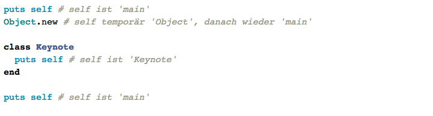

!SLIDE slide x=-700 y=-3200

## Prototype based coding

<ul>
  <li>bekannt aus JavaScript</li>
  <li>&nbsp;</li>
  <li>keine Unterscheidung zw. Klassen & Objekten</li>
  <li>&nbsp;</li>
  <li>pure Form von OO?</li>
</ul>

!SLIDE slide x=-700  y=-3900

## Prototype based coding

**Methodendefinition**

  <ul>
    <li>Schlüsselwort def gefolgt vom Namen</li>
    <li>&nbsp;</li>
    <li>destruktive Methoden enden mit !</li>
    <li>&nbsp;</li>
    <li>Methoden mit boolscher Auswertung enden mit ?</li>
  </ul>

!SLIDE slide x=-700 y=-4600

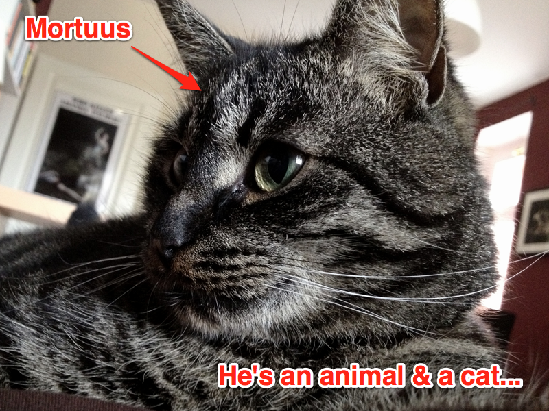

!SLIDE slide x=-700 y=-5300

## Prototype based coding

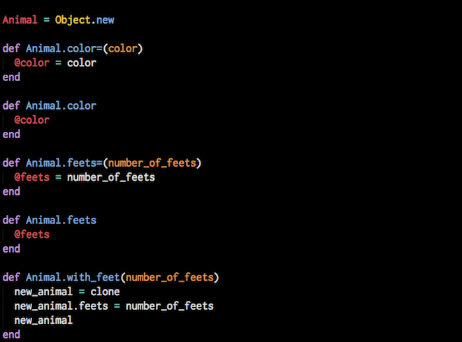

!SLIDE slide x=-700 y=-6000

!SLIDE slide x=-700 y=-6700

## Prototype based coding

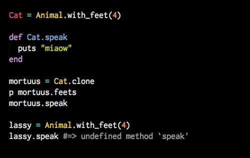

!SLIDE slide x=-700 y=-7400

## Prototype based coding

Aufgabe

  Eine Autofabrik umfasst folgendes Sortiment:
<ul>
  <li>dreitürige Kleinwagen mit vier Sitzen</li>
  <li>LKWs mit verschiedenen Auflageflächen</li>
  <li>Familien Vans mit 8 Sitzen und einer Anhängekupplung</li>
</ul>
  Die Firma 'Microsoft' bestellt in dieser Fabrik für
  die Mitarbeiter

<ul>
  <li>9 rote Kleinwagen (45 PS) mit dem Navigationsgerät "City" zu je 9800 Euro</li>
  <li>4 blaue Familienvans (120 PS) mit dem Navigationsgerät "City+" und einer Anhängerkupplung zu je 23000 Euro</li>
  <li>für das Facility Management 1 gelber LKW (180 PS) mit der Auflagefläche "groß"
  zu je 73000 Euro</li>
</ul>

Aus technischen Gründen können Navigationsgeräte nicht in Nutzfahrzeugen verbaut werden.

Die Firma 'Microsoft' erwartet von der Autofabrik einedetailierte, typabhängige Übersicht über die Bestellung.
 

!SLIDE slide x=-700 y=-8100

## Prototype based coding

<a href="https://gist.github.com/309922f748d66130c13d">Beispiellösung</a>

!SLIDE slide x=-1550 y=-2400

## Class based coding

Klassen sind "Factories" um Objekte zu erzeugen. 

Zusammenfassung von State & Behaviour.

!SLIDE slide x=-2050 y=-1700

## Class based coding

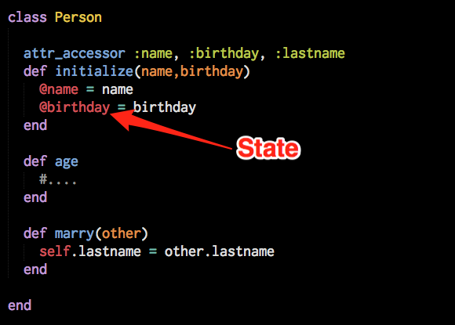

!SLIDE slide x=-2050 y=-1000

## Class based coding

!SLIDE slide x=-2050 y=-300

## Class based coding

  <ul>
    <li>Ist ein Objekt vom Typ Class</li>
    <li>Schlüsselwort class gefolgt vom Namen</li>
    <li>&nbsp;</li>
    <li>"Konstruktor" ist #initialize()</li>
    <li>&nbsp;</li>
    <li>Objekte werden erzeugt mit #new()</li>
  </ul>

!SLIDE slide x=-2400 y=-2400

## Instanzvariablen

<ul>
  <li>immer privat!</li>
  <li>&nbsp;</li>
  <li>mit @ gekennzeichnet</li>
  <li>&nbsp;</li>
  <li>auf self definiert</li>
</ul>

!SLIDE slide x=-3250 y=-2400

## Klassenvariablen

<ul>
  <li>immer privat!</li>
  <li>&nbsp;</li>
  <li>mit @@ gekennzeichnet</li>
  <li>&nbsp;</li>
  <li>müssen vor Gebrauch initialisiert werden</li>
  <li>&nbsp;</li>
  <li>werden vererbt, sind aber eindeutig</li>
</ul>

!SLIDE slide x=-4100 y=-2400

## Instanzmethoden

<ul>
  <li>wirkt im Kontext der Klasse</li>
  <li>&nbsp;</li>
  <li>Zugriff auf Instanzvariablen und State des Objekts</li>
  <li>&nbsp;</li>
  <li>private,protected,public</li>
</ul>

!SLIDE slide x=-4950 y=-2400

## Klassenmethoden

<ul>
  <li>existiert nur im Objekt, das die Klasse definiert</li>
  <li>&nbsp;</li>
  <li>verschiedene Wege der Definition, meist über self</li>
  <li>&nbsp;</li>
  <li>Aber: gibt es defacto nicht!</li>
</ul>

!SLIDE slide x=-5800 y=-2400

## Vererbung

<ul>
  <li>Vererbung durch Klassenstruktur</li>
  <li>&nbsp;</li>
  <li>Module</li>
</ul>

!SLIDE rotate=180 x=-6650 y=-2400

!SLIDE slide x=-7500 y=-2400

## Vererbung

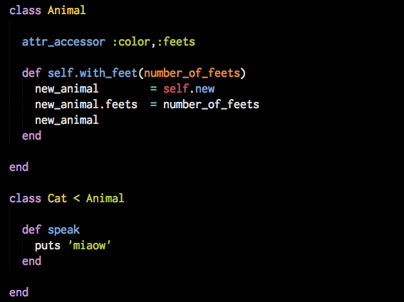

!SLIDE slide x=-8350 y=-2400

## Vererbung

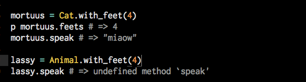

<ul>
  <li>von jedem Ausdruck vererbbar</li>
  <li>&nbsp;</li>
  <li>rechts vom < kein Klassenname</li>
  <li>&nbsp;</li>
  <li>rechts vom < Konstante, die Objekt repräsentiert</li>
</ul>

!SLIDE slide x=-9200 y=-2400

## Module

<ul>
  <li>Namespace</li>
  <li>&nbsp;</li>
  <li>können nicht instanziert werden</li>
  <li>&nbsp;</li>
  <li>Schlüsselwort module gefolgt vom Namen</li>
</ul>

!SLIDE slide x=-10050 y=-2400

## Mixins

  <ul>
    <li>Prinzip der Erweiterung von Klassen</li>
    <li>&nbsp;</li>
    <li>Instanzmethoden</li>
    <li>&nbsp;</li>
    <li>Klassenmethoden</li>
    <li>&nbsp;</li>
    <li>Mehrfachvererbung?</li> 
  </ul>

!SLIDE rotate=180 x=-10900 y=-2400

## RSpec & Ruby Object Model

  <a href="https://gist.github.com/cd1a96f8bd3dd0cce3f2">BDD Beispiel</a>

!SLIDE slide x=-11750 y=-2400

## Ruby Object Model

  Hi, I'm Mr. Anonymous and I'm a ghost. Call me anon. Every time you define singleton methods on
  an object or include a module, I'm around and take care of it. 

!SLIDE slide x=-12600 y=-2400

## Blocks, procs und lambdas

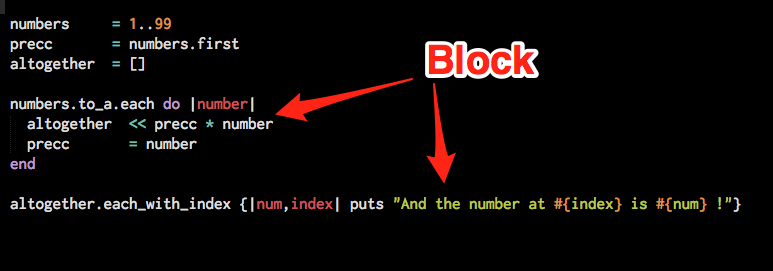

  <ul>
    <li>"anonyme" Ansammlung von Code (closure)</li>
    <li>&nbsp;</li>
    <li>Variablen haben im Block lokale Gültigkeit</li>
    <li>&nbsp;</li>
    <li>wenn außerhalb definiert, dann im Block identisch</li> 
    <li>&nbsp;</li>
    <li>Aufruf u.a. über yield</li>
  </ul>

!SLIDE slide x=-13450 y=-2400

## Blocks und yield

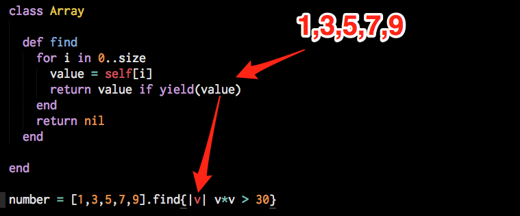

  <ul>
    <li>führt und wertet den Block aus (Rückgabe!)</li>
    <li>&nbsp;</li>
    <li>nimmt Argumente entgegen</li>
    <li>&nbsp;</li>
    <li><i>multiple values for a block parameter (0 for 1)</i></li> 
  </ul>

!SLIDE slide x=-14300 y=-2400

## Procs

  <ul>
    <li>"anonyme" Ansammlung von Code (closure)</li>
    <li>&nbsp;</li>
    <li>Pararell assignment</li>
    <li>&nbsp;</li>
    <li>"return" vom umgebenden Kontext</li>
    <li>&nbsp;</li>
    <li>als inline code betrachtbar</li>
  </ul>

!SLIDE slide x=-15150 y=-2400

## Procs

Beispiel

!SLIDE slide x=-16000 y=-2400

## Lambdas

  <ul>
    <li>"anonyme" Ansammlung von Code (closure)</li>
    <li>&nbsp;</li>
    <li>explizite Parameterprüfung</li>
    <li>&nbsp;</li>
    <li>"return" vom Block</li>
    <li>&nbsp;</li>
    <li>als anonyme Methode betrachtbar</li>
  </ul>

!SLIDE slide x=-16850 y=-2400

## Lambdas

Beispiel

!SLIDE slide x=-17700 y=-2400

## Metaprogrammierung

!SLIDE slide x=-18550 y=-2400

## Monkeypatching

<ul>
  <li>Verändern von Objekten zur Laufzeit</li>
</ul>

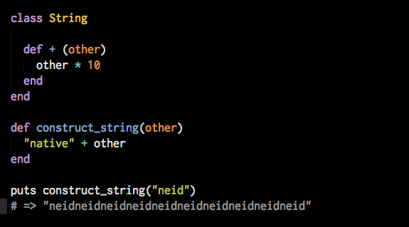

!SLIDE slide x=-19400 y=-2400

## define_method

  <ul>
    <li>erstellt Instanzmethode auf dem Empfänger</li>
    <li>&nbsp;</li>
    <li>Parameter kann Proc, Methode oder UnboundMethod Objekt sein</li>
    <li>&nbsp;</li>
    <li>Verwendet intern instance_eval</li>
  </ul>

!SLIDE slide x=-20250 y=-2400

## define_method

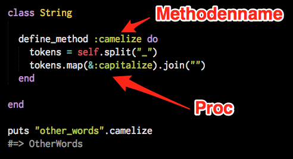

!SLIDE slide x=-21100 y=-2400

## eval got some sisters

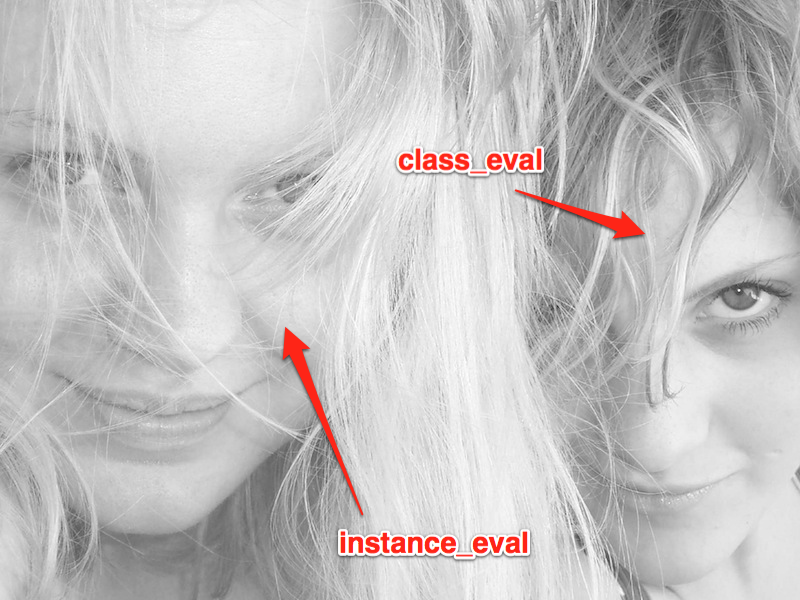

!SLIDE slide x=-21950 y=-2400

## class_eval

  <ul>
    <li>evaluiert String oder Block im Kontext der Klasse</li>
    <li>&nbsp;</li>
    <li><i>Öffne die Klasse und füge ihr eine neue Methode hinzu.</i></li>
  </ul>

!SLIDE slide x=-22800 y=-2400

## instance_eval

  <ul>
    <li>evaluiert String oder Block im Kontext des Empfängers</li>
    <li>&nbsp;</li>
    <li><i>Definiere die Methoden nur für diese Instanz der Klasse</i></li>
  </ul>

!SLIDE slide x=-22800 y=-1700

## method_missing

  <ul>
    <li>Wird aufgerufen, wenn Empfänger Nachricht erhält, die nicht verarbeitbar ist.</li>
    <li>&nbsp;</li>
    <li>Verwendbar um Vorhandensein von Methoden zu simulieren.</li>
  </ul>

!SLIDE slide x=-22800 y=-1000

## method_missing

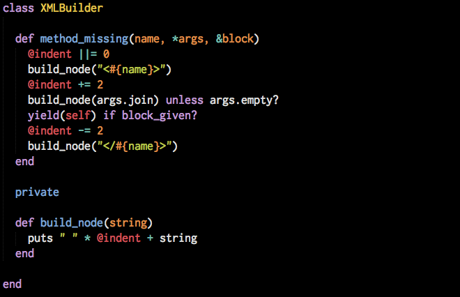

!SLIDE slide x=-22800 y=-300

## method_missing

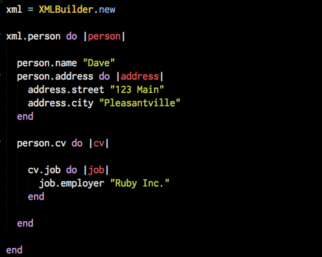

!SLIDE slide x=-22800 y=400

## method_missing

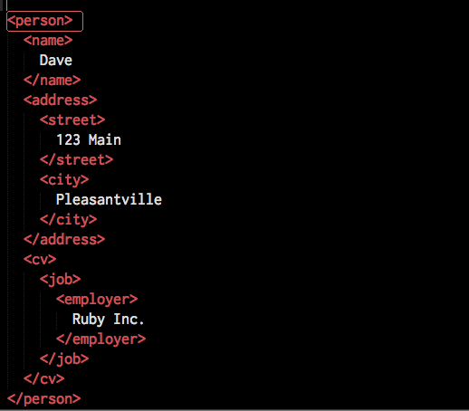

!SLIDE slide x=-22800 y=1100

## const_missing

  <ul>
    <li>Wird aufgerufen, wenn eine Konstante "angesprochen" wird, die nicht definiert wurde.
    </li>
  </ul>

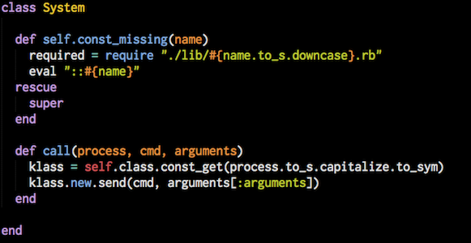

!SLIDE slide x=-13000 y=0

## Internals

!SLIDE slide x=-13000 y=700

## INTERNALS

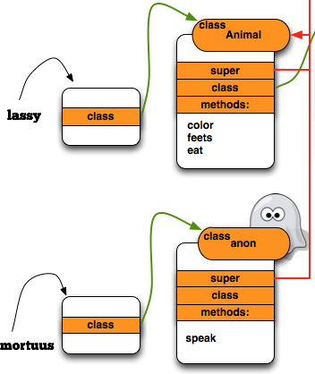

!SLIDE slide x=-13000 y=1400

## INTERNALS

!SLIDE rotate=180 x=-13850 y=0

## C-Extensions 

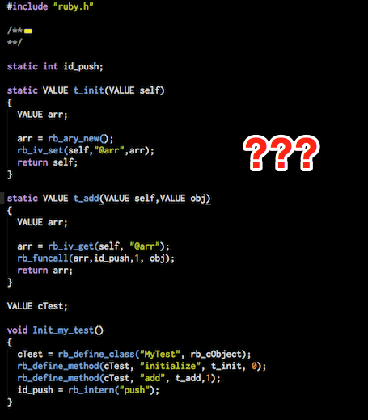

!SLIDE slide x=-13850 y=700

## C-Extensions 

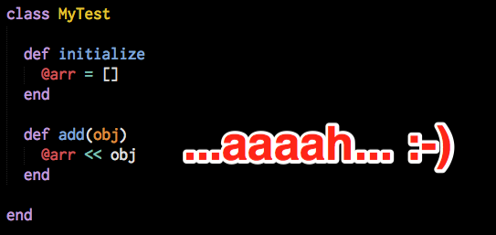

!SLIDE rotate=720 x=-13850 y=1400

## JASON

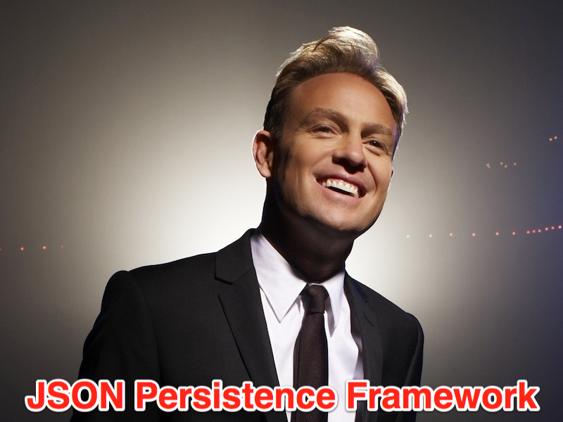
